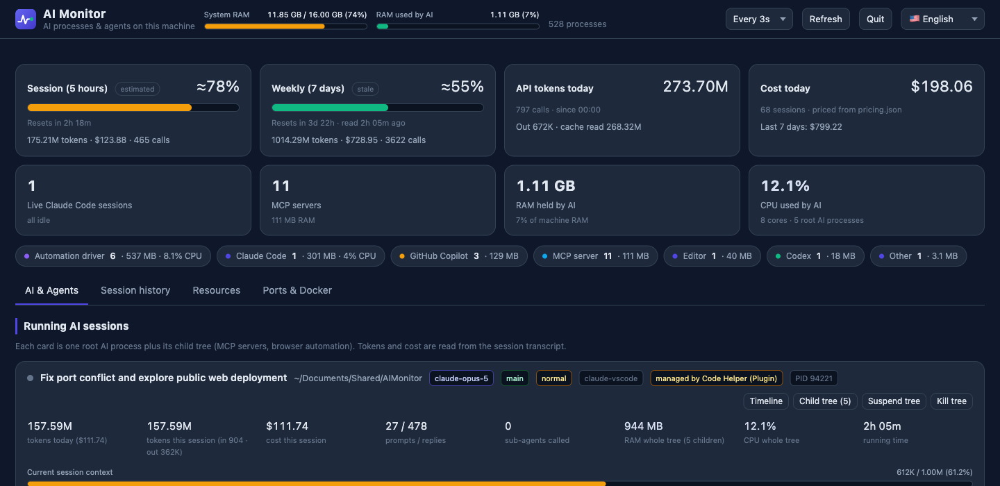
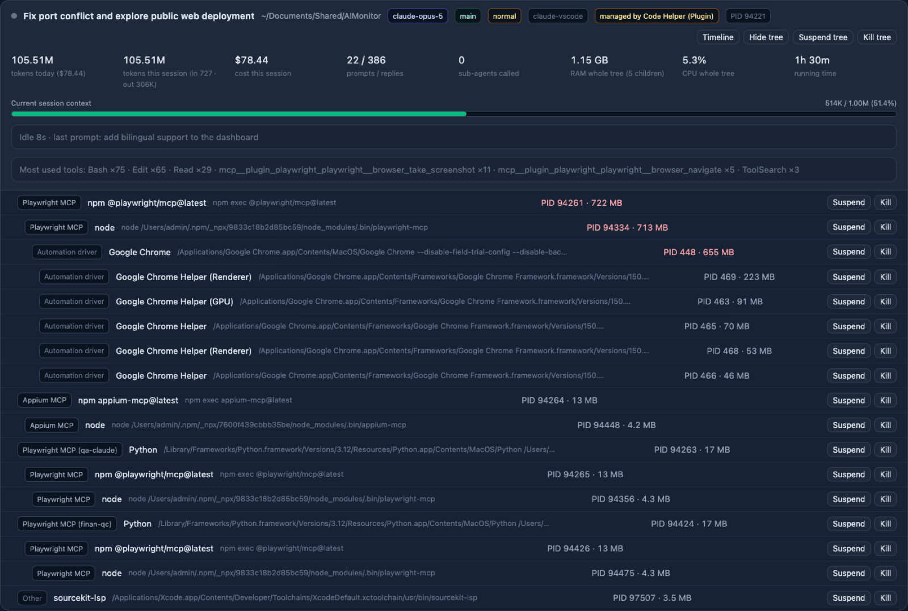

<div align="center">


# AI Monitor

**English** · [Tiếng Việt](README.vi.md)

See what your AI coding tools are really doing to your machine.

[](https://github.com/hominhtuong/AIMonitor/releases)
[](LICENSE)
[](#2-install-the-app)
[](https://www.python.org/)
[](https://github.com/hominhtuong/AIMonitor/blob/main/CLAUDE.md)
[](https://github.com/hominhtuong/AIMonitor/releases)

</div>

---

A local dashboard for the AI tools running on your machine: **Claude Code, Codex, Copilot,
Gemini CLI, Ollama**.

Activity Monitor only tells you "Python is eating 2 GB of RAM". AI Monitor tells you *which*
Python: which Claude Code session, which folder it has open, what command it is running right
now, how many tokens it burned, how long before you hit your usage limit - and which ones you
can safely kill.

Everything runs on your machine. No data leaves it, no account needed, nothing to install
beyond Python (already present on macOS and Linux).



---

## Contents

1. [Run it in 30 seconds](#1-run-it-in-30-seconds)
2. [Install the app](#2-install-the-app)
3. [Why you need this: one session, 20+ processes](#3-why-you-need-this-one-session-20-processes)
4. [What's on screen](#4-whats-on-screen)
5. [Shutting processes down](#5-shutting-processes-down)
6. [Session and Weekly limits](#6-session-and-weekly-limits)
7. [What the token and cost numbers mean](#7-what-the-token-and-cost-numbers-mean)
8. [FAQ](#8-faq)
9. [Contributing](#9-contributing)
10. [Support](#10-support)

---

## 1. Run it in 30 seconds

**macOS / Linux**

```bash
git clone https://github.com/hominhtuong/AIMonitor.git
cd AIMonitor
./run.sh
```

**Windows**

```cmd
git clone https://github.com/hominhtuong/AIMonitor.git
cd AIMonitor
run.cmd
```

Your browser opens automatically. Stop it with `Ctrl+C`, or click **Quit** on the page.

No need to worry about port clashes: it prefers `8899`, and if that is busy it moves to the
next free port and prints the real address. If AI Monitor is already running, it reopens the
existing tab instead of starting a second copy.

---

## 2. Install the app

On macOS, AI Monitor is a **real app**: its own window, its own Dock icon, quit with Cmd+Q.
No browser tab, no terminal.

### Option 1: download a prebuilt release

1. Open the **Releases** tab and download `AIMonitor-macos.zip`.
2. Unzip it and drag `AIMonitor.app` into your **Applications** folder.
3. Open it.

That's all. The app is signed with a Developer ID and notarized by Apple, so macOS raises no
warning - no right-click trick, no unlocking in System Settings.

Your machine only needs Python 3.9 or newer, which macOS already ships.

### Option 2: build from source

```bash
./scripts/install_macos.sh
```

Installs into `/Applications`, launches it, and reports back. If the app fails to start, the
script tells you instead of failing silently. Re-run it after every `git pull` so the app
picks up the new code.

### Windows

Download `AIMonitor.exe` from **Releases** and run it. **No Python needed.** The dashboard
opens in its own window; closing the window stops everything.

On first run, SmartScreen shows a warning because the file is not code-signed yet: click
**More info => Run anyway**.

To run from source instead, clone the repo and create a shortcut:

```powershell
powershell -ExecutionPolicy Bypass -File scripts\build_windows.ps1
```

### VSCode

If you would rather keep the dashboard next to your code, install the extension from the
Marketplace:
[**AI Monitor**](https://marketplace.visualstudio.com/items?itemName=mituultra.aimonitor).
Search "AI Monitor" in the Extensions panel, or run

```bash
code --install-extension mituultra.aimonitor
```

An AI Monitor icon appears in the activity bar and the dashboard opens as a panel inside the
editor. Install and open it - that is the whole setup. The extension finds Python by itself
(the `py` launcher, `PATH`, and the standard install folders), so it works even when Python
was installed without being added to `PATH`. If the machine has no Python 3.9+ at all, the
panel says so and gives you a **Download Python** button and a **Try again** button.

AI Monitor also sits in the status bar at the bottom of the window showing your Session and
Weekly limits; clicking it opens the dashboard as a full editor tab. Settings live under
Extensions => AI Monitor - which Python to use, refresh interval, light or dark, and more.

Offline installs can still grab the `.vsix` from **Releases** and use Extensions panel =>
`...` menu => **Install from VSIX...**

---

## 3. Why you need this: one session, 20+ processes

This is a **single** Claude Code session with its child tree expanded:



One session. **1.15 GB of RAM** across more than twenty processes:

| What it is | RAM |
| --- | --- |
| Playwright MCP (npm + node) | 722 MB + 713 MB |
| Chrome opened by browser automation | 655 MB |
| Chrome helpers (renderer, GPU, ...) | 223 + 91 + 70 + 53 + 46 MB |
| Appium MCP, other MCP servers, LSP | ~90 MB combined |

None of that shows up as "Claude Code" in Activity Monitor. You see a dozen anonymous `node`,
`Python` and `Google Chrome Helper` entries and no way to tell which belongs to what. When a
session ends badly, these children are often orphaned and keep holding memory.

AI Monitor groups them under the session that spawned them, so you can see the real cost of a
session and kill the whole tree with one button.

---

## 4. What's on screen

The interface is **bilingual** - pick 🇺🇸 English or 🇻🇳 Vietnamese from the language dropdown
at the top right. Your choice is remembered.

**Top bar** - system RAM, RAM held by AI, refresh interval, and the Refresh / Quit buttons.

**Two limit cards** - Session (5 hours) and Weekly (7 days), see [section 6](#6-session-and-weekly-limits).

**"AI & Agents" tab** - one card per running AI session:

- task name, working folder, git branch, model in use
- tokens and cost for the session
- how much context is still free
- what it is doing right now, e.g. `Bash(npm test) 3.2s`
- sub-agents running in parallel
- the child tree: MCP servers, browsers opened by automation, RAM per branch
- a timeline of the last 60 actions

Below that are closed sessions, viewable for today or the last 7 days.

**"Session history" tab** - answers "which task burned the most?". Grouped by project and by
session, with a share column, filtering and sorting. This tab only scans when you open it.

**"Resources" tab** - the 80 processes using the most RAM, filterable by name or limited to
AI-related ones. Anything above 400 MB is highlighted red.

**"Ports & Docker" tab** - which ports are taken (handy when Appium or Playwright leaves one
hanging) and which Docker containers are running.

> All figures cover **this machine only**. If you use the same account on several machines,
> each one sees just its own share.

---

## 5. Shutting processes down

Every card has buttons to **suspend** (freeze, keeps its memory, resumable) or **kill**.
Kill tree takes down every child process underneath as well.

Every action asks for confirmation. AI Monitor itself and its parent processes can never be
killed by accident.

Suspend is unavailable on Windows (the OS has no equivalent), so the button hides itself.

If a card is tagged *"managed by ..."*, an IDE supervises that process: kill it and the IDE
will start it again. To stop it for good, disable the matching extension.

---

## 6. Session and Weekly limits

The two cards at the top answer "how much longer can I keep going?". The big number is always
a **percentage**, with a small badge telling you where it came from:

| Badge | Meaning |
| --- | --- |
| *(none)* | Official figure from Claude Code, fresh. Trustworthy. |
| `adjusted` | Official figure plus an estimate of what you have used since it was refreshed. |
| `stale` | Official but read a while ago. The window has not reset, so the real value is higher, never lower. |
| `estimated` | Derived from local token usage. Approximate. |
| `no figure` | Not enough data for a number worth trusting. |

The line underneath always shows **how long until the next reset** and how many tokens the
current window has used.

The number comes from the same place Claude Code stores its own percentages, so it matches the
*Account & Usage* panel. That store is a cache which Claude Code refreshes periodically, so AI
Monitor adds an estimate of the usage since the last refresh - which is what the `adjusted`
badge means. In practice it tracks `/usage` in the CLI within a point or two.

AI Monitor only reads local files. It never calls the Anthropic API with your credentials.

---

## 7. What the token and cost numbers mean

- **API tokens** include cache reads, so large numbers are normal on long sessions (tens of
  millions). This is traffic through the API, not the length of your conversation.
- **Cost** is converted using API list prices so you can compare sessions against each other.
  On a subscription plan this is **not** the amount you are billed. Edit `pricing.json` to
  change the rates.
- "Today" starts at 00:00 local time.

---

## 8. FAQ

**I killed Copilot and it came back.** VS Code restarted it, that is not a bug in this tool.
Disable the extension to stop it for good.

**The Session or Weekly card says `stale`.** Claude Code has not refreshed its figure
recently. Open Claude Code and it updates itself, see [section 6](#6-session-and-weekly-limits).

**No AI sessions listed.** For Claude Code, check that `~/.claude/projects/` has data. For
Codex or Copilot, only RAM and CPU can be tracked - they do not write a readable transcript.

**Port 8899 is busy.** Nothing to do, the tool moves to another port. To force one specific
port: `./run.sh --port 9001 --strict-port`.

**Does the page flicker when it refreshes?** No. Each refresh only touches the values that
actually changed, keeping your scroll position and any expanded branches.

---

## 9. Contributing

Pull requests are welcome. `main` is protected: fork or branch, then open a PR - see
[CONTRIBUTING.md](CONTRIBUTING.md) for the workflow and the checks to run before pushing.

Technical documentation, design decisions and the traps already hit live in
[CLAUDE.md](CLAUDE.md).

---

## 10. Support

- Homepage: [mituultra.com](https://mituultra.com)
- Email: [minhtuong2502@gmail.com](mailto:minhtuong2502@gmail.com)
- Bugs and feature requests: [GitHub Issues](https://github.com/hominhtuong/AIMonitor/issues)
