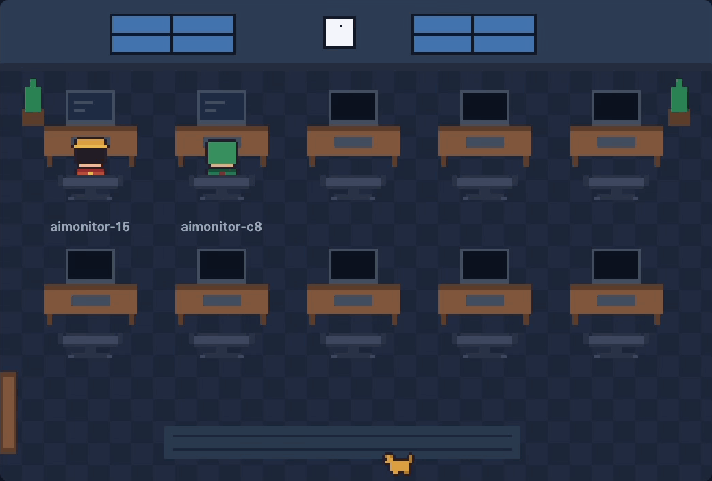
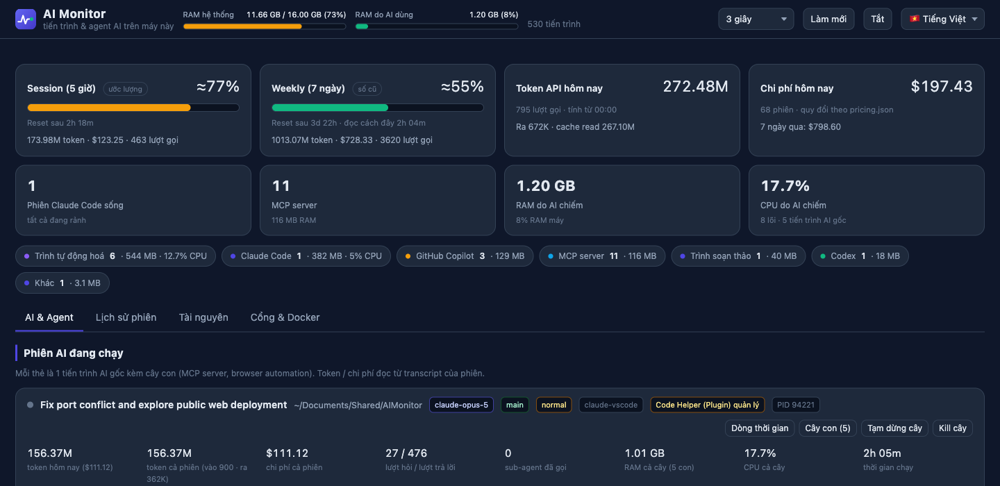
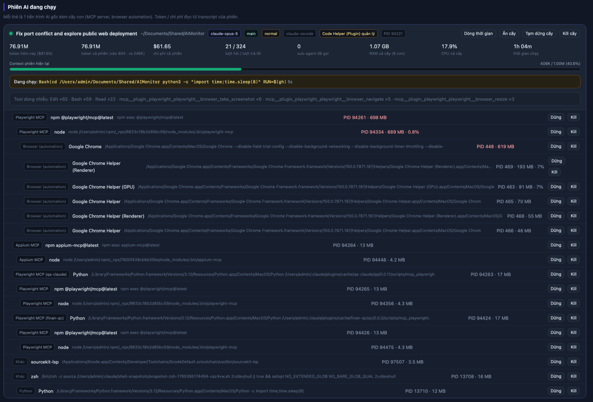

<div align="center">


# AI Monitor

[English](README.md) · **Tiếng Việt**

Nhìn rõ các công cụ AI đang làm gì với máy của bạn.

[](https://github.com/hominhtuong/AIMonitor/releases)
[](LICENSE)
[](#2-cài-app)
[](https://www.python.org/)
[](https://github.com/hominhtuong/AIMonitor/blob/main/CLAUDE.md)
[](https://github.com/hominhtuong/AIMonitor/releases)



*Mọi agent AI đang chạy trên máy, mỗi đứa một bàn làm việc - ngay cạnh chỗ bạn viết code.*

</div>

---

Bảng theo dõi các công cụ AI đang chạy trên máy bạn: **Claude Code, Codex, Copilot,
Gemini CLI, Ollama**.

Activity Monitor chỉ cho bạn thấy "Python đang ăn 2 GB RAM". AI Monitor cho bạn thấy *Python
nào*: phiên Claude Code nào, đang mở thư mục nào, đang chạy lệnh gì, đã tốn bao nhiêu token,
còn bao lâu nữa thì đụng hạn mức - và tắt được cái nào.

Chạy hoàn toàn trên máy bạn. Không gửi dữ liệu đi đâu, không cần đăng nhập, không cài thêm gì
ngoài Python (macOS và Linux có sẵn).

**Bật cả ngày cũng gần như không tốn gì.** Đo trên máy M2 8 nhân đang chạy hơn 500 tiến trình:
**0.7% CPU của cả máy và khoảng 30 MB RAM** khi mở dashboard, **0.01% CPU** khi chỉ hiện nút ở
thanh trạng thái. Đóng panel là về 0 - không có tiến trình nào chạy ngầm phía sau. Số đo đầy
đủ và cách đo: [docs/hieu-nang.md](docs/hieu-nang.md).



---

## Mục lục

1. [Mở lên trong 30 giây](#1-mở-lên-trong-30-giây)
2. [Cài app](#2-cài-app)
3. [Vì sao cần tool này: một phiên, hơn 20 tiến trình](#3-vì-sao-cần-tool-này-một-phiên-hơn-20-tiến-trình)
4. [Màn hình có gì](#4-màn-hình-có-gì)
5. [Tắt bớt tiến trình AI](#5-tắt-bớt-tiến-trình-ai)
6. [Hạn mức Session và Weekly](#6-hạn-mức-session-và-weekly)
7. [Số token và chi phí nghĩa là gì](#7-số-token-và-chi-phí-nghĩa-là-gì)
8. [Hỏi đáp nhanh](#8-hỏi-đáp-nhanh)
9. [Đóng góp code](#9-đóng-góp-code)
10. [Hỗ trợ](#10-hỗ-trợ)

---

## 1. Mở lên trong 30 giây

**macOS / Linux**

```bash
git clone https://github.com/hominhtuong/AIMonitor.git
cd AIMonitor
./run.sh
```

**Windows**

```cmd
git clone https://github.com/hominhtuong/AIMonitor.git
cd AIMonitor
run.cmd
```

Browser tự mở. Dừng bằng `Ctrl+C` ở terminal, hoặc bấm nút **Tắt** trên trang.

Không cần lo trùng cổng: mặc định dùng `8899`, bận thì tự nhảy sang cổng trống và in địa chỉ
thật ra màn hình. Nếu AI Monitor đã chạy sẵn thì nó mở lại đúng tab cũ chứ không bật thêm.

---

## 2. Cài app

Trên macOS, AI Monitor là **app thật sự**: có cửa sổ riêng, icon dưới Dock, đóng bằng Cmd+Q.
Không mở tab browser, không cần terminal.

### Cách 1: tải bản dựng sẵn

1. Vào tab **Releases**, tải `AIMonitor-macos.zip`.
2. Giải nén, kéo `AIMonitor.app` vào thư mục **Applications**.
3. Mở lên dùng.

Hết. App đã được ký Developer ID và Apple chứng thực (notarize) nên macOS không cảnh báo gì -
không phải chuột phải, không phải vào System Settings mở khoá.

Máy chỉ cần có Python 3.9 trở lên, macOS có sẵn.

### Cách 2: tự build từ code

```bash
./scripts/install_macos.sh
```

Cài vào `/Applications`, chạy thử ngay và báo lại kết quả. App không lên được thì script báo
lỗi chứ không im lặng. Sau mỗi lần `git pull`, chạy lại lệnh này để app dùng bản mới.

### Windows

Tải `AIMonitor.exe` từ **Releases** về chạy thẳng. **Không cần cài Python.** Giao diện mở
trong cửa sổ riêng, đóng cửa sổ là tắt hẳn.

Lần đầu chạy, SmartScreen cảnh báo vì file chưa mua chứng chỉ ký: bấm
**More info => Run anyway**.

Muốn chạy từ source thì clone repo rồi tạo shortcut:

```powershell
powershell -ExecutionPolicy Bypass -File scripts\build_windows.ps1
```

### VSCode

Muốn để dashboard ngay cạnh code thì cài extension từ Marketplace:
[**AI Monitor**](https://marketplace.visualstudio.com/items?itemName=mituultra.aimonitor).
Tìm "AI Monitor" trong tab Extensions, hoặc chạy:

```bash
code --install-extension mituultra.aimonitor
```

Cài xong, icon AI Monitor xuất hiện ở activity bar (thanh biểu tượng bên trái), bấm vào là
dashboard mở thành một panel trong editor. **Cài rồi mở lên là dùng được, không phải cấu hình
gì.** Extension tự đi tìm Python trên máy: py launcher, PATH, và các thư mục cài mặc định -
nên máy cài Python mà quên tick "Add to PATH" vẫn chạy bình thường. Chỉ khi máy thật sự chưa
có Python 3.9 trở lên thì panel mới báo, kèm nút **Tải Python** và nút **Thử lại**: cài xong
bấm Thử lại là xong.

AI Monitor còn nằm ở thanh trạng thái dưới cùng cửa sổ, hiện luôn % Session và Weekly; bấm
vào là dashboard mở thành một tab riêng với bố cục đầy đủ. Phần cài đặt nằm ở Extensions =>
AI Monitor: chọn Python, nhịp làm mới, giao diện sáng/tối, và một số thứ khác.

Ai cần cài offline thì tải file `.vsix` ở **Releases**, rồi vào Extensions panel => nút `...`
=> **Install from VSIX...**

---

## 3. Vì sao cần tool này: một phiên, hơn 20 tiến trình

Đây là **một** phiên Claude Code duy nhất, mở cây con ra:



Một phiên thôi mà kéo theo **hơn 1 GB RAM** rải trên hơn hai chục tiến trình:

| Là gì | RAM |
| --- | --- |
| Playwright MCP (npm + node) | 698 MB + 689 MB |
| Chrome do browser automation mở | 619 MB |
| Các helper của Chrome (renderer, GPU...) | 193 + 91 + 70 + 55 + 46 MB |
| Appium MCP, các MCP server khác, LSP | ~90 MB cộng lại |

Không cái nào trong số đó hiện ra với tên "Claude Code" trong Activity Monitor. Bạn chỉ thấy
một đống `node`, `Python`, `Google Chrome Helper` vô danh và không cách nào biết cái nào của
ai. Phiên nào tắt không sạch thì đám con này thành mồ côi và vẫn giữ nguyên RAM.

AI Monitor gom chúng về đúng phiên đã sinh ra chúng, nên bạn thấy được giá thật của một phiên
và tắt cả cây bằng một nút.

---

## 4. Màn hình có gì

Giao diện **hai ngôn ngữ** - chọn 🇺🇸 English hoặc 🇻🇳 Tiếng Việt ở dropdown góc trên bên phải.
Lựa chọn được nhớ lại.

**Đầu trang** - RAM toàn máy, RAM riêng phần AI, chu kỳ tự làm mới, nút Làm mới và Tắt.

**Hai ô hạn mức** - Session (5 giờ) và Weekly (7 ngày), xem [mục 6](#6-hạn-mức-session-và-weekly).

**Tab "AI & Agent"** - mỗi thẻ là một phiên AI đang chạy:

- tên tác vụ, thư mục làm việc, git branch, model đang dùng
- token và chi phí của phiên
- context còn trống bao nhiêu
- việc đang chạy ngay lúc này, ví dụ `Bash(npm test) 3.2s`
- sub-agent đang chạy song song
- cây con: MCP server, trình duyệt do automation mở, RAM từng nhánh
- dòng thời gian 60 thao tác gần nhất

Bên dưới là các phiên đã đóng, xem theo hôm nay hoặc 7 ngày.

**Chỉ hiện loại agent bạn thật sự dùng.** Mặc định dashboard chỉ hiện Claude Code. Máy nào
cũng sẵn một mớ tiến trình nền được xếp vào loại AI mà bạn không hề chạy - Copilot đi kèm VS
Code chẳng hạn - bày hết ra chỉ tổ che mất thứ cần xem. Thanh **"Hiện:"** ngay dưới các tab
liệt kê những loại đang có trên máy kèm số lượng; bấm để bật hoặc tắt từng loại, bấm "Tất cả
loại" để xem hết. Lựa chọn được nhớ lại, và áp cho cả tab Văn phòng.

**Tab "Văn phòng"** - vẫn từng ấy thông tin nhưng bày thành một văn phòng pixel nhỏ. Mỗi agent
đang chạy là một nhân vật: có việc thì ngồi vào bàn làm, và màn hình của nó cho biết đang làm
loại việc gì - xanh dương là sửa file, xanh lá là đọc và tìm kiếm, cam là chạy lệnh, tím là
lấy dữ liệu web. Rảnh quá một phút rưỡi thì nhân vật đứng dậy đi vòng vòng. Sub-agent hiện ra
thành người nhỏ hơn đứng cạnh bàn của người gọi nó. Bấm vào máy tính nào thì mở đầy đủ phiên
đó, kèm cả cây tiến trình.

Có **bảy bộ nhân vật**: Văn phòng, Thú cưng, Slime, Mascot mỗi bộ mười người, Năm anh em năm
người, Hải trình và Nhẫn giả mỗi bộ ba mươi sáu người. Mở mục **Bộ
nhân vật** ngay dưới căn phòng là thấy hết kèm hình xem trước; chọn một bộ thì cả phòng đổi
theo, mỗi agent một nhân vật khác nhau, đông quá thì quay vòng dùng lại. Bấm vào một nhân vật
trong phòng thì bảng chi tiết hiện thêm dãy nhân vật của bộ đó - bấm một cái là đổi riêng cho
người đó thôi. Cả hai lựa chọn đều được nhớ lại.

Muốn dùng nhân vật của riêng mình thì bấm nút **+** cạnh các bộ có sẵn và chọn một tấm ảnh có
nhiều nhân vật. Tool tự tách nền, tự cắt từng nhân vật và đưa về đúng khuôn. **Ảnh không rời
khỏi máy bạn**: đọc ngay trong trang, không gửi đi đâu, và bộ bạn thêm không nằm trong bản phát
hành. Ảnh nền phẳng và các nhân vật cách nhau thì tách chuẩn nhất - xem
[hướng dẫn tự tạo bộ nhân vật](docs/tao-bo-nhan-vat.md) để biết tool tách theo quy tắc nào.

Nhiều agent chạy cùng lúc thì nhìn cái này nhanh hơn đọc thẻ: biết ngay ai đang bận mà không
phải đọc chữ nào. Phòng có mười bàn; đông hơn thì dòng đếm phía trên nói rõ còn bao nhiêu
người chưa hiện.

**Tab "Lịch sử phiên"** - trả lời "tác vụ nào ngốn nhiều nhất". Gộp theo project và theo từng
phiên, có cột tỷ trọng, lọc và sắp xếp được. Tab này chỉ quét khi bạn mở nó.

**Tab "Tài nguyên"** - 80 tiến trình ngốn RAM nhất, lọc được theo tên hoặc chỉ xem phần liên
quan AI. Tiến trình trên 400 MB tô đỏ.

**Tab "Cổng & Docker"** - cổng nào đang bị chiếm (hay dùng khi Appium hoặc Playwright treo
cổng) và các container Docker đang chạy.

> Số liệu chỉ của **riêng máy này**. Nếu bạn dùng chung tài khoản trên nhiều máy, mỗi máy chỉ
> thấy phần của nó.

---

## 5. Tắt bớt tiến trình AI

Mỗi thẻ có nút để **tạm dừng** (đóng băng, giữ nguyên RAM, chạy tiếp được sau) hoặc **kill**
(tắt hẳn). Kill cây sẽ tắt luôn toàn bộ tiến trình con bên dưới.

Mọi thao tác đều hỏi xác nhận. Bản thân AI Monitor và các tiến trình cha của nó không bao giờ
bị tắt nhầm.

Tạm dừng không có trên Windows (hệ điều hành không hỗ trợ), nút sẽ tự ẩn.

Nếu thẻ có nhãn *"... quản lý"* thì tiến trình đó do IDE trông coi: tắt xong IDE sẽ tự bật
lại. Muốn dứt điểm thì tắt extension tương ứng trong IDE.

---

## 6. Hạn mức Session và Weekly

Hai ô đầu trang trả lời câu hỏi "còn dùng được bao lâu nữa". Số to luôn là **phần trăm**, kèm
một nhãn nhỏ cho biết số đó lấy từ đâu:

| Nhãn | Nghĩa là |
| --- | --- |
| *(không có nhãn)* | Số chính thức của Claude Code, còn mới. Tin được. |
| `có bù` | Số chính thức cộng thêm phần ước lượng đã dùng kể từ lần nó làm mới. |
| `số cũ` | Số chính thức nhưng đọc đã lâu. Cửa sổ chưa reset nên thực tế chỉ cao hơn, không thấp hơn. |
| `ước lượng` | Suy ra từ lượng token local. Là số xấp xỉ. |
| `chưa có số` | Chưa đủ dữ liệu để đưa ra con số đáng tin. |

Dòng dưới luôn cho biết **còn bao lâu nữa tới mốc reset** và lượng token đã dùng trong cửa sổ
hiện tại.

Con số lấy đúng từ chỗ Claude Code lưu phần trăm của chính nó, nên khớp với bảng
*Account & Usage*. Chỗ lưu đó là cache và Claude Code chỉ làm mới theo chu kỳ, nên AI Monitor
cộng thêm phần đã tiêu kể từ lần làm mới gần nhất - đó là ý nghĩa của nhãn `có bù`. Thực tế
số bám sát `/usage` trong CLI trong khoảng 1-2 điểm.

AI Monitor chỉ đọc file trên máy, không bao giờ tự gọi API Anthropic bằng tài khoản của bạn.

---

## 7. Số token và chi phí nghĩa là gì

- **Token API** đếm cả phần cache đọc lại, nên con số rất lớn là bình thường với phiên dài
  (hàng chục triệu). Đây là lượng token đi qua API, không phải độ dài cuộc trò chuyện.
- **Chi phí** là quy đổi theo bảng giá API để bạn so sánh giữa các phiên. Nếu bạn dùng gói
  thuê tháng thì đây **không phải** số tiền bị trừ. Muốn đổi giá thì sửa `pricing.json`.
- "Hôm nay" tính từ 00:00 giờ máy.

---

## 7b. Cấu hình

Extension VSCode có bảng settings riêng (Extensions => AI Monitor). App macOS và bản `.exe`
đọc file `~/.aimon/config.json`, bạn tự tạo:

```json
{
  "theme": "light",
  "refresh_seconds": 5,
  "claude_dir": "~/work/.claude",
  "pricing_file": "~/bang-gia-rieng.json",
  "port": 8899,
  "ai_kinds": ["claude-code", "gemini"],
  "office_pack": "pets"
}
```

Khoá nào cũng không bắt buộc. File hỏng hoặc không có thì dùng mặc định, không bao giờ làm
dashboard không mở được. Nút sáng/tối ở đầu trang đè lên `theme` cho riêng máy đó.

`ai_kinds` là loại agent hiện lúc mới mở - đặt `["*"]` để hiện tất cả. Giá trị hợp lệ:
`claude-code`, `codex`, `copilot`, `gemini`, `cursor`, `ollama`, `local-llm`. Đây chỉ là điểm
khởi đầu: thanh "Hiện:" trên trang vẫn bật tắt được và lựa chọn đó được nhớ.

Trong extension VSCode, ba ô đường dẫn (Python, thư mục dữ liệu Claude, bảng giá) **tự được
điền** sau lần chạy đầu, nên bạn nhìn là biết ngay tool đang dùng cái gì thay vì thấy ô trống.
Mỗi ô có nút **Detect again** để dò lại và chọn từ danh sách. Đường dẫn nào chết - ví dụ bảng
giá đi kèm sau khi extension cập nhật - sẽ tự được thay ở lần khởi động sau. Xoá trắng một ô
là quay lại chế độ tự dò mỗi lần chạy, và extension sẽ không tự điền lại nữa.

---

## 7c. Hiệu năng: tool này ăn bao nhiêu của máy bạn

Số đo thật, không phải ước lượng - trên Apple M2 (8 nhân, 16 GB) đang chạy hơn 500 tiến trình
và 870 MB transcript của Claude. Cách đo và số đầy đủ: **[docs/hieu-nang.md](docs/hieu-nang.md)**.

| Bạn đang làm gì | CPU (của cả máy) | RAM |
| --- | --- | --- |
| Chưa mở / đã đóng panel | **0%** - không có tiến trình nào | 0 |
| Chỉ hiện nút ở thanh trạng thái | **0.01%** | 30 MB |
| Panel mở nhưng đang bị che | **0%** - ngừng hỏi hẳn | 30 MB |
| Đang mở dashboard | **0.37%** | 30 MB + ~40 MB cho trang |
| Dashboard + khung nhìn Văn phòng | **0.70%** | 30 MB + ~47 MB cho trang |

Vài điều đáng biết:

- **Không mở thì không chạy gì.** Nút ở thanh trạng thái không bao giờ tự bật server, nó chỉ
  hiện số nếu đã có server chạy sẵn. Đóng panel là tiến trình thoát.
- **Bị che là nằm im.** Thu gọn panel thì cả vòng hỏi dữ liệu lẫn hoạt cảnh dừng hẳn - đã
  kiểm bằng cách đếm số request thật, không phải đọc code rồi đoán.
- **Một lần làm mới tốn 86 ms CPU** (tính cả tiến trình con `ps` và `lsof`), và chỉ chạy mỗi
  3 giây trong lúc bạn đang nhìn.
- **Khung nhìn Văn phòng là phần nặng nhất**, nhưng chỉ nặng khi có nhân vật đang di chuyển.
  Mọi người ngồi yên ở bàn thì nó vẽ 5 khung mỗi giây thay vì 60.
- **Windows tốn hơn.** Bên đó không có `ps` nên phải bật PowerShell để đọc danh sách tiến
  trình - ước chừng 10-35% một nhân, so với 3% trên macOS. Chưa đo được trên máy Windows thật,
  xem mục Windows trong tài liệu.

---

## 8. Hỏi đáp nhanh

**Tắt Copilot rồi nó lại chạy?** Đó là VS Code tự bật lại, không phải lỗi tool. Muốn dứt điểm
thì disable extension.

**Ô Session hoặc Weekly có nhãn `số cũ`?** Claude Code chưa chạy lại nên chưa làm mới phần
trăm. Mở Claude Code lên là số tự cập nhật, xem [mục 6](#6-hạn-mức-session-và-weekly).

**Không thấy phiên AI nào?** Với Claude Code, kiểm tra thư mục `~/.claude/projects/` đã có dữ
liệu chưa. Với Codex hay Copilot, tool chỉ theo dõi được RAM và CPU vì chúng không ghi lịch sử
theo dạng đọc được.

**Cổng 8899 đang bận?** Không cần làm gì, tool tự chuyển cổng. Muốn ép đúng một cổng thì
`./run.sh --port 9001 --strict-port`.

**Trang có nhấp nháy khi tự làm mới?** Không. Mỗi lần làm mới chỉ sửa đúng con số thay đổi,
giữ nguyên vị trí cuộn và các nhánh đang mở.

---

## 9. Đóng góp code

Rất hoan nghênh Pull Request. Nhánh `main` được bảo vệ: hãy fork hoặc tạo nhánh riêng rồi mở
PR - xem [CONTRIBUTING.md](CONTRIBUTING.md) để biết quy trình và các bước kiểm tra cần chạy
trước khi push.

Đặc tả kỹ thuật, các quyết định thiết kế và những cái bẫy đã gặp nằm ở [CLAUDE.md](CLAUDE.md).

---

## 10. Hỗ trợ

- Trang chủ: [mituultra.com](https://mituultra.com)
- Email: [minhtuong2502@gmail.com](mailto:minhtuong2502@gmail.com)
- Báo lỗi và đề xuất tính năng: [GitHub Issues](https://github.com/hominhtuong/AIMonitor/issues)
